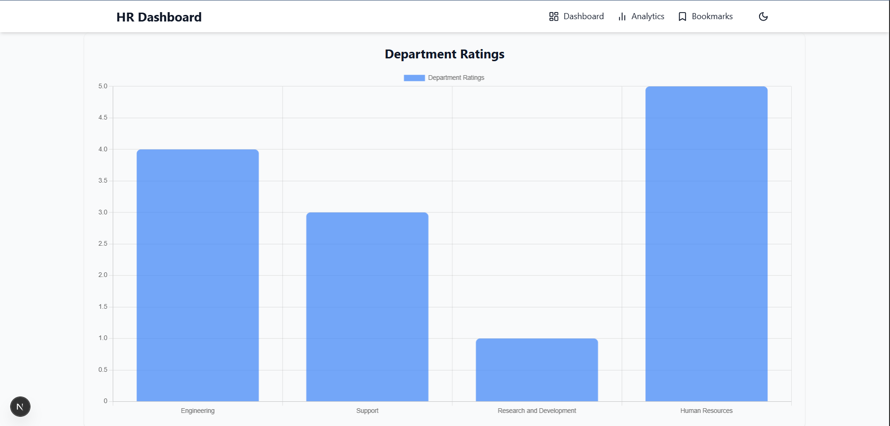

# Deployment Link
https://hr-dashboard-lyart.vercel.app/

## Setup Instructions 
To Run in Local Machine:
1. Clone the repository
2. npm i
3. npm run dev

## Website Preview (Screenshots)
1. Dashboard (List of all employee)

2. Filter users according to department and also search

3. Individual employee information with performance , feedback and Projects

4. Can BookMark any employee and see in bookmark Page

5. Analytics department wise and rating wise (used mock data)

6. Can Switch between Dark and Light mode
